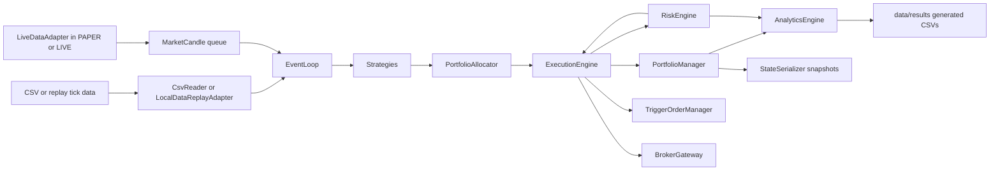

# TradeBot Architecture

## Purpose And Authority

- Purpose: authoritative description of TradeBot system structure, boundaries, data flow, and architectural constraints.
- Authority level: architecture policy below accepted ADRs and risk policy, above active plans.
- Audience: operator, maintainers, Codex, contributors, reviewers, testers, and research agents.

## System Purpose

TradeBot is a C++20 trading-system research and engineering repository with a deterministic core for market-data replay, L2 order book logic, strategy execution, portfolio/risk accounting, trigger orders, analytics, metrics, state serialization, tests, and benchmarks. It has live-capable adapter classes, but live trading is prohibited unless explicitly authorized through the risk and live-readiness gates.

## Architectural Principles

- Default to deterministic `BACKTEST` behavior.
- Keep replay, research, execution, risk, broker, analytics, and persistence boundaries explicit.
- Preserve dry-run and paper behavior as the safe default for live-like workflows.
- Keep credentials outside source and documentation.
- Keep generated outputs outside Git unless intentionally versioned.
- Require tests for changed behavior and benchmarks for performance claims.
- Do not promote unverified legacy claims into architecture.

## Verified Components

| Area | Verified files | Responsibility |
| --- | --- | --- |
| Runtime config | `include/SystemConfig.hpp` | `BACKTEST`, `PAPER`, `LIVE` modes; endpoints; credential env names; circuit-breaker thresholds |
| CSV input | `CsvReader` | Candle input for deterministic backtest path |
| Local replay | `LocalDataReplayAdapter` | CSV/binary replay ticks, pacing, generated binary replay writes |
| Order book | `L2OrderBook` | L2 level storage, BBO updates, recentering |
| Strategies | `IStrategy`, `SmaCrossStrategy`, `MeanReversionStrategy` | Signal generation boundary |
| Allocation/regime | `PortfolioAllocator`, `RegimeDetector` | Strategy weights and market-regime classification |
| Portfolio/risk | `PortfolioManager`, `RiskEngine` | Position accounting, drawdown, VaR, circuit breakers, halt state |
| Execution | `ExecutionEngine`, `TriggerOrderManager` | Signal execution, pending/trigger orders, broker routing bridge |
| Live data | `LiveDataAdapter` | Live-like candle queue, simulated external payload/test hooks, reconnect/gap-fill state |
| Broker | `BrokerGateway`, `IBrokerAdapter`, `DeterministicBrokerAdapter`, `OrderLifecycleStore` | Broker-neutral order normalization, lifecycle events, paper-mode deterministic adapter simulation, live-capable broker boundary, reconciliation snapshot |
| Network/auth | `AsyncNetworkClient`, `AuthManager` | Async network bridge, HMAC signing, env/config credential loading |
| Analytics/persistence | `AnalyticsEngine`, `MetricsAggregator`, `LocalMetricsExporter`, `StateSerializer` | CSV outputs, latency summaries, local metrics, resume snapshots |
| Tests | `tests/phase13_tests.cpp` through `tests/phase18_tests.cpp` | Phase regression coverage |
| Benchmarks | `src/benchmarks/` | Throughput, Phase 18 burn-in, Phase 19 `applyBbo` microbenchmark |

## Data Flow



## Control Flow

1. `src/main.cpp` parses `--mode` and `--resume`.
2. `SystemConfig` defaults to `BACKTEST`.
3. In `BACKTEST`, file readers drive deterministic candle streams.
4. In non-backtest modes, `LiveDataAdapter` and `BrokerGateway` are connected.
5. Per-symbol strategies and event loops produce signals.
6. `PortfolioAllocator` weighs strategies.
7. `RiskEngine` gates new trading actions.
8. `ExecutionEngine` simulates fills or routes through `BrokerGateway` when bound.
9. Analytics and state snapshots write generated outputs.

## Execution Modes

Verified code modes:

- `BACKTEST`: default deterministic CSV-driven path.
- `PAPER`: live-data-like adapter path with simulated broker behavior.
- `LIVE`: live-capable data and broker execution path.

Architecture policy:

- `BACKTEST` and dry-run behavior are safe defaults.
- `PAPER` must remain simulated locally unless explicitly connected to a sandbox by approved work.
- `LIVE` must remain locked by policy, operator approval, risk review, and readiness checklist.
- Sandbox is a governance concept, not a verified `SystemMode` value.

## Exchange And Broker Boundary

`BrokerGateway` is the broker boundary. It owns broker-neutral order normalization, local-to-external identity correlation, lifecycle event handling, cancellation, reconciliation snapshot handling, paper-mode deterministic adapter simulation, and live-capable broker interaction. `IBrokerAdapter` implementations attach below `BrokerGateway`; provider-native schemas must be translated into broker-neutral lifecycle, execution, cancel, health, account, instrument, and reconciliation contracts before core components consume them. Execution logic must not bypass `BrokerGateway` for live-capable order side effects.

## Market-Data Boundary

`CsvReader` and `LocalDataReplayAdapter` handle local data. `LiveDataAdapter` handles live-like and live-capable market data. Strategy, portfolio, and risk components should consume normalized candles or replay ticks through explicit interfaces rather than parsing external payloads directly.

## Order-Book Boundary

`L2OrderBook` owns BBO and level-state behavior. Changes to `applyBbo`, recentering, best quote validity, or tick mapping require targeted tests and performance evidence when performance is claimed.

## Replay Boundary

`LocalDataReplayAdapter` owns replay tick loading, binary serialization, pacing modes, and cursor behavior. Replay compatibility changes require `docs/DATA_POLICY.md` review and tests for CSV/binary behavior.

## Strategy Boundary

Strategies emit signals and should not directly mutate portfolio state, bypass risk gates, or access credentials. New research or ML logic must enter through explicit signal, parameter, or configuration interfaces.

## Portfolio And Risk Boundary

`PortfolioManager` owns position and trade accounting. `RiskEngine` owns drawdown, VaR, position limits, halt state, circuit breakers, and live volatility scaling. Execution must consult risk before opening new positions.

## Analytics And Persistence Boundary

`AnalyticsEngine`, `MetricsAggregator`, `LocalMetricsExporter`, and `StateSerializer` write generated results, latency reports, metrics, and snapshots. Generated outputs belong under ignored paths unless intentionally versioned.

## Testing Architecture

CTest registers phase tests:

- `phase13_tests`
- `phase15_tests`
- `phase16_tests`
- `phase17_tests`
- `phase18_tests`
- `phase22_tests`

Tests are C++ executables linked against `tradebot_core_lib`. Some tests create temporary files under `/tmp`.

## Benchmark Architecture

Benchmark executables:

- `throughput_bench`
- `phase18_burnin`
- `apply_bbo_microbench`

Benchmark outputs can write generated CSVs under `data/results/` or logs under `build/`. Performance claims require command, environment, input size, result, and comparison basis.

## Configuration Handling

Configuration currently lives in `SystemConfig` and CLI parsing in `src/main.cpp`. Verified CLI flags:

- `--mode backtest|paper|live`
- `--resume <snapshot-file>`

Unrecognized mode strings parse to `BACKTEST`. Credential env fallbacks are `AIIO_API_KEY` and `AIIO_API_SECRET`.

## Credential Boundary

`AuthManager` loads credentials from `SystemConfig` first, then environment variables. Secrets must not be committed, logged, or documented. Documentation may mention env var names but never values.

## Extension Points

- New strategies through `IStrategy`.
- Research outputs through structured configuration, replay outputs, or strategy parameter interfaces.
- New tests as CTest executables.
- New benchmarks under `src/benchmarks/` with generated outputs under ignored paths.
- New ADRs for durable architectural decisions.

## Prohibited Coupling

- Strategies must not directly place broker orders.
- Research code must not bypass risk gates.
- Live-capable adapters must not be enabled by default.
- Credential loading must not move into strategy or analytics code.
- Generated results must not become hidden inputs to source behavior without explicit data policy review.
- Performance optimizations must not silently weaken correctness tests or risk behavior.

## Current Architectural Debt

- Source comments reference deprecated MOP/workstream labels; ADR 0001 makes those labels historical only.
- `docs/ARCHITECTURE.md` previously referenced `data/historical/` before that path existed in the tracked tree; it is now described as code-referenced, not tracked.
- Build currently emits two warnings.
- No configured formatter, static analyzer, or Markdown link checker was found.
- Live-capable code exists, but live readiness is not established.

## Architecture Validation

Validate architecture-affecting work with:

```sh
cmake -S . -B build
cmake --build build
ctest --test-dir build --output-on-failure
```

Add targeted tests and benchmarks when touching replay, order-book, execution, risk, broker, or performance paths. Update this document and create or update an ADR for durable boundary changes.
